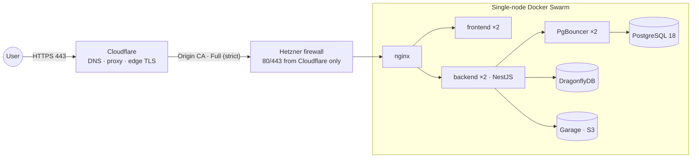

<div align="center">

# 📸 Dropicture

**Free, open source photo platform built for data ownership.**
Run it on your own machine, on any server you control, or on European cloud infrastructure — your photos never have to leave hardware you trust.

[](https://github.com/redjem-amir/dropicture/actions/workflows/deploy.yml)
[](LICENSE)

[Website](https://dropicture.com) · [Architecture](#architecture) · [Run it locally](#run-it-on-your-machine) · [Deploy it](#deploy-it) · [Issues](https://github.com/redjem-amir/dropicture/issues)

</div>

---

## Why Dropicture

Photo storage today usually means handing your library to a US hyperscaler. Dropicture is the alternative: a complete, MIT-licensed photo service you actually own, with three ways to run it.

- 🖥️ **On your machine** — a single Compose file brings up the whole data layer locally. Your photos stay on your disk.
- ☁️ **On your own cloud** — any Linux box with Docker can run the production stack.
- 🇪🇺 **On European infrastructure** — the reference deployment targets [Hetzner](https://www.hetzner.com/) (Falkenstein, Germany), fully described as code in this repository: one `terraform apply` and one Ansible playbook away.

In every mode, media lives in a self-hosted, S3-compatible [Garage](https://garagehq.deuxfleurs.fr/) store and metadata in PostgreSQL — no third-party object storage, no vendor lock-in.

## Architecture



| Service | Role | Image |
|---|---|---|
| `proxy` | TLS termination, reverse proxy, real client IP | `nginx:stable-alpine` |
| `frontend` | Web client | `ghcr.io/redjem-amir/dropicture/frontend` |
| `backend` | REST API — NestJS, TypeORM, rate limiting | `ghcr.io/redjem-amir/dropicture/backend` |
| `pgbouncer` | Transaction-level connection pooling | `edoburu/pgbouncer` |
| `db` | Relational store | `postgres:18` |
| `dragonfly` | Redis-compatible cache & throttle storage | `dragflydb/dragonfly` |
| `garage` | S3-compatible object storage (media) | `dxflrs/garage` |

## Repository layout

```
dropicture/
├── .github/workflows/         # CI/CD — build, publish, deploy
├── ansible/                   # Server provisioning & Swarm bootstrap
├── app/                       # Application source (backend, frontend)
├── docs/                      # Diagrams
├── terraform/                 # Hetzner + Cloudflare infrastructure (IaC)
├── docker-compose.local.yml   # Local stack
├── docker-compose.yml         # Production stack (Docker Swarm)
├── garage.toml                # Object storage configuration
├── nginx.conf                 # Reverse proxy configuration
├── HELP.md
└── LICENSE                    # MIT
```

## Run it on your machine

**Prerequisites:** Docker with Compose v2, Node.js ≥ 20.

Create a `.env` at the repository root (it is gitignored):

```bash
cat <<'EOF' > .env
POSTGRES_DB=dropicture
POSTGRES_USER=dropicture
POSTGRES_PASSWORD=change-me
GARAGE_RPC_SECRET=$(openssl rand -hex 32)
S3_ACCESS_KEY_ID=GK$(openssl rand -hex 16)
S3_SECRET_ACCESS_KEY=$(openssl rand -hex 32)
S3_BUCKET=dropicture-media
EOF
```

Then bring up the data layer and start the apps:

```bash
docker compose -f docker-compose.local.yml up -d
```

The local stack mirrors production: the backend talks to **PgBouncer on `localhost:5432`**, PostgreSQL is reachable directly on `localhost:5433` for psql and IDEs, DragonflyDB on `6379`, the Garage S3 API on `3900`. See [`app/`](app/) for running the backend and frontend in dev mode.

## Deploy it

### On your own cloud

The production stack ([`docker-compose.yml`](docker-compose.yml)) runs on any Docker host:

```bash
docker swarm init
docker stack deploy -c docker-compose.yml dropicture
```

Bring your own TLS material: the stack expects the certificate as an external Swarm config (`dropicture_origin_cert`) and the key as an external Swarm secret (`dropicture_origin_key`).

### Reference deployment — European cloud

The fully automated path provisions a hardened single-node Swarm on Hetzner Cloud (EU), fronted by Cloudflare DNS with edge TLS:

```bash
cd terraform && terraform init && terraform apply   # server, firewall, DNS, TLS
cd ../ansible && ansible-playbook playbook.yml      # Docker, Swarm, secrets
git push origin main                                # CI builds and deploys
```

Step-by-step guides: [`terraform/README.md`](terraform/README.md) · [`ansible/README.md`](ansible/README.md).

The pipeline ([`.github/workflows/deploy.yml`](.github/workflows/deploy.yml)) builds the images, publishes them to GHCR tagged with the commit SHA, then deploys over SSH with `docker stack deploy` and smoke-tests the public URL. The `production` environment requires these secrets:

| Secret | Purpose |
|---|---|
| `AWS_ACCESS_KEY_ID` / `AWS_SECRET_ACCESS_KEY` | Read-only access to the Terraform state bucket |
| `SSH_PRIVATE_KEY_B64` | Base64-encoded deploy key |
| `POSTGRES_DB` / `POSTGRES_USER` / `POSTGRES_PASSWORD` | Database credentials |
| `GARAGE_RPC_SECRET` | Garage RPC secret |
| `S3_ACCESS_KEY_ID` / `S3_SECRET_ACCESS_KEY` | Garage access key for the media bucket |

## Security

Ingress on 80/443 is restricted to Cloudflare's IP ranges at the cloud firewall, TLS terminates on an Origin CA certificate (Full strict), SSH is key-only, and the data plane (PostgreSQL, DragonflyDB, Garage) lives on an internal overlay network with no published ports. Credentials and TLS keys are distributed as Swarm secrets.

To report a vulnerability, please use [GitHub Security Advisories](https://github.com/redjem-amir/dropicture/security/advisories/new) rather than a public issue.

## Contributing

Contributions are welcome — fork, branch, and open a pull request. For substantial changes (architecture, infrastructure), please open an issue first to discuss the approach. Infrastructure changes should come with updated docs and diagrams.

## License

Released under the [MIT License](LICENSE) — free to use, self-host, modify and redistribute.

## Acknowledgments

Dropicture stands on excellent open source software: [Garage](https://garagehq.deuxfleurs.fr/), [DragonflyDB](https://www.dragonflydb.io/), [PgBouncer](https://www.pgbouncer.org/), [NestJS](https://nestjs.com/), [PostgreSQL](https://www.postgresql.org/) and [nginx](https://nginx.org/).